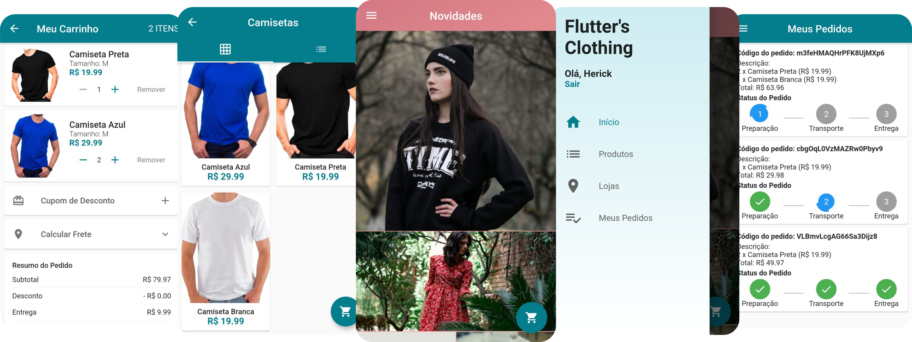

<h1 align="center">
    Loja Virtual
</h1>

  

 

  

## :rocket: Tecnologias

Esse projeto foi desenvolvido com as seguintes tecnologias:

- [Flutter](https://flutter.dev/)
- [Firebase](https://firebase.google.com/)

## 💻 Projeto

- O projeto é a versão do cliente de uma loja virtual, desenvolvida no [curso de criação de Apps com Flutter](https://www.udemy.com/course/curso-completo-flutter-app-android-ios/) para aprimoramento de conhecimento no desenvolvimento mobile com Flutter.
- O app simula todo o processo de navegação e compra em uma loja virtual, com exceção da conexão com api de pagamentos.

## 🤔 Como testar

- Faça um clone desse repositório: `git clone https://github.com/herickport/loja-virtual.git`;

- Utilizando um emulator ou dispositivo físico e com o flutter instalado na máquina, rode o comando: `flutter run`;

## :memo: Licença

Esse projeto está sob a licença MIT. Veja o arquivo [LICENSE](LICENSE) para mais detalhes.